# 一、LRZIP

## 1.下载、解压

1.地址：[ckolivas/lrzip: Long Range Zip (github.com)](https://github.com/ckolivas/lrzip)

2.release：https://github.com/ckolivas/lrzip/archive/refs/tags/v0.651.tar.gz

3.解压：解压到桌面

## 2.安装&&fuzz

1.获取clang、llvm、gcc、afl（略）；

2.在目录下打开终端，输入：

```
./autogen.sh
```

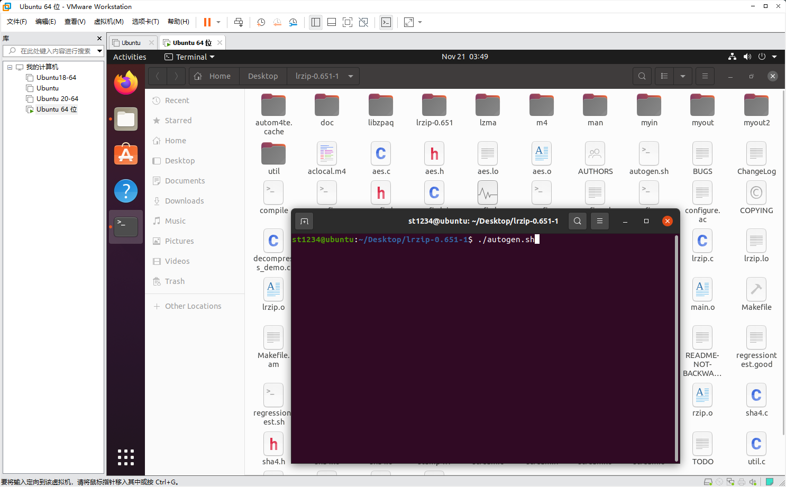

3.在输入

```
CC=afl-gcc ./configure --disable-shared
```

的时候，缺少一些库：

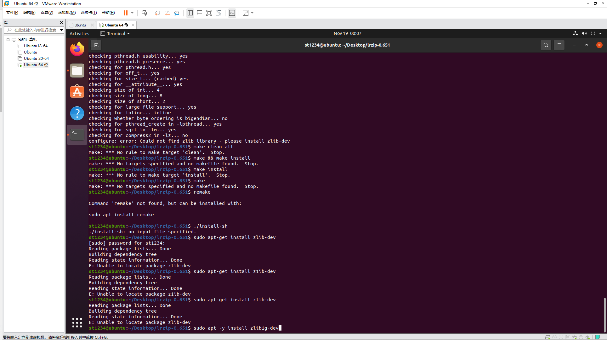

此时安装zlib-dev是找不到的，需要安装如下的包：

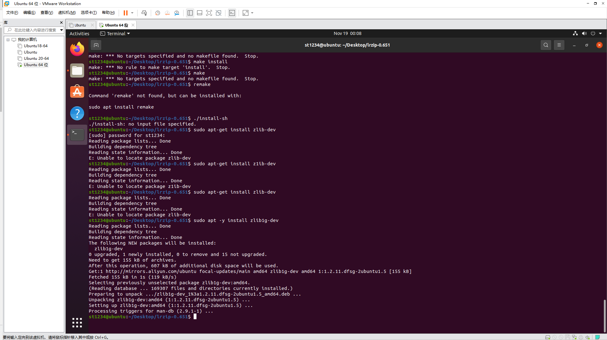

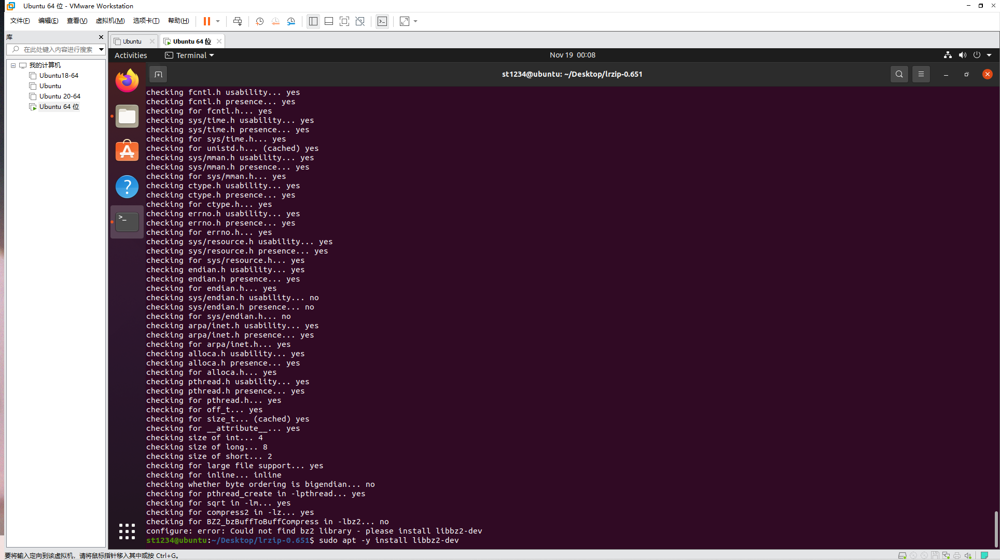

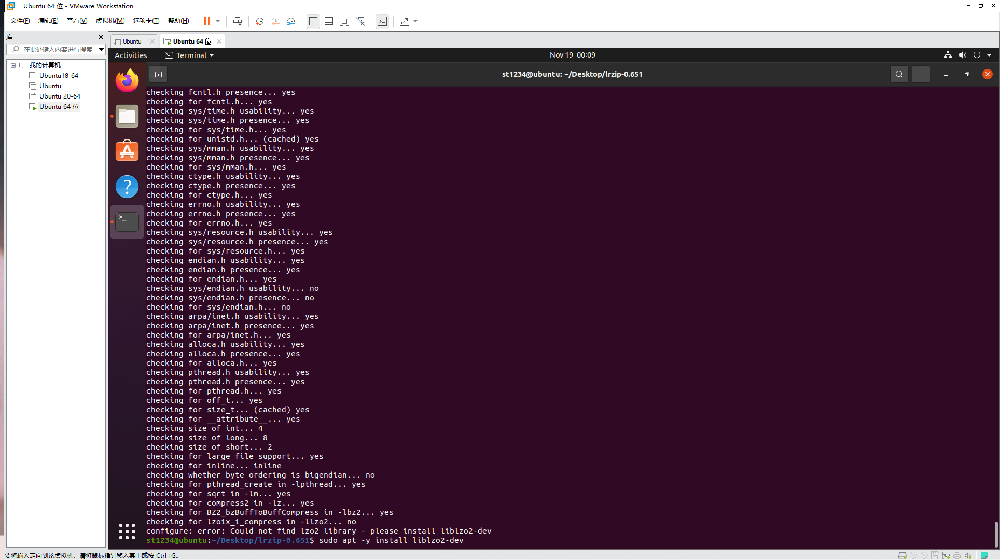


4.make clean all

5.选择测试用例并运行

```
afl-fuzz -i myin -o myout /home/st1234/Desktop/lrzip-0.651/lrzip -f @@
```

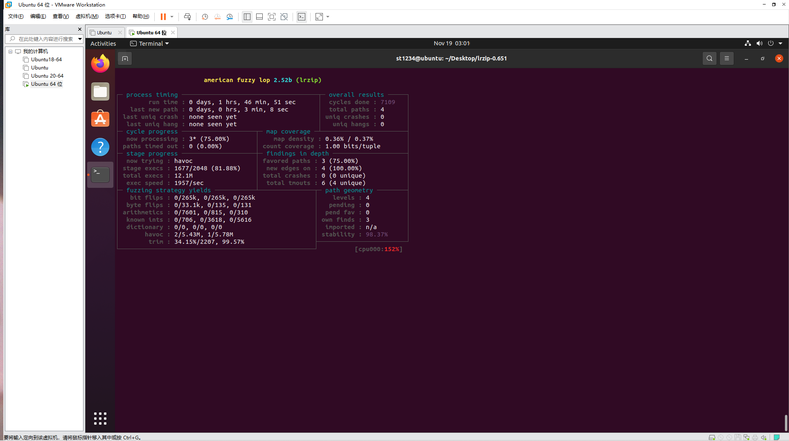

## 3.插桩

1.安装clang12

```
sudo apt-get install clang12
```

2.安装mull12

```
curl -1sLf 'https://dl.cloudsmith.io/public/mull-project/mull-stable/setup.deb.sh' | sudo -E bash
sudo apt-get update
sudo apt-get install mull-12
```

3.重新解压，放入mull.yml，插桩

```
export CC=clang-12
export CFLAGS="-fexperimental-new-pass-manager -fpass-plugin=/usr/lib/mull-ir-frontend-12 -g -grecord-command-line"
./autogen.sh
./configure
make
```

4.效果

```
mull-runner-12 ./lrzip /home/st1234/Desktop/lrzip-0.651-1/myout/queue/id:000002,src:000001,op:havoc,rep:128,+cov
```

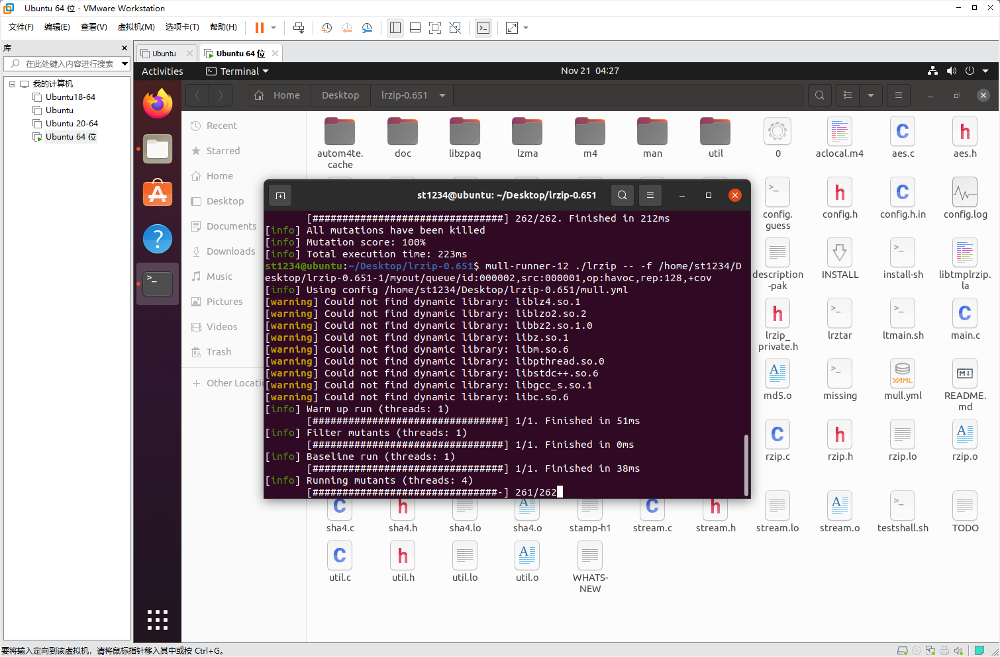

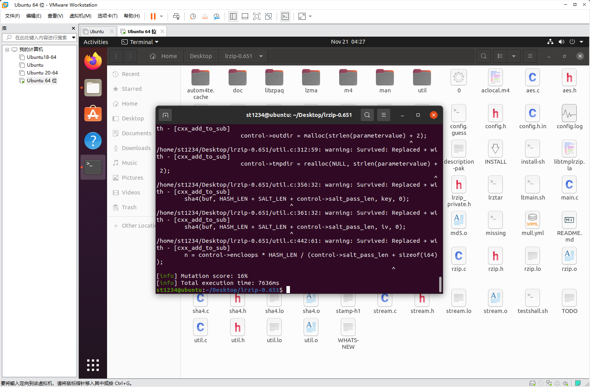

# 二、w3m

## 1.下载、解压

地址：[tats/w3m: Debian's w3m: WWW browsable pager (github.com)](https://github.com/tats/w3m)

release：https://github.com/tats/w3m/archive/refs/tags/v0.5.3+git20220429.tar.gz

解压：解压到桌面

## 2.安装&&fuzz

1.在输入

```
CC=afl-gcc ./configure --disable-shared
```

的时候，缺少gc.h

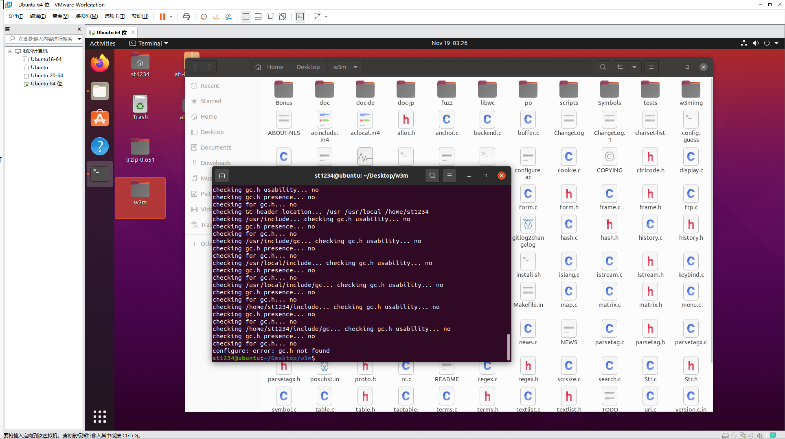

解决方案：下载gc并安装:解压	./configure	make	make install

2.回到w3m make && make clean all

3.效果图

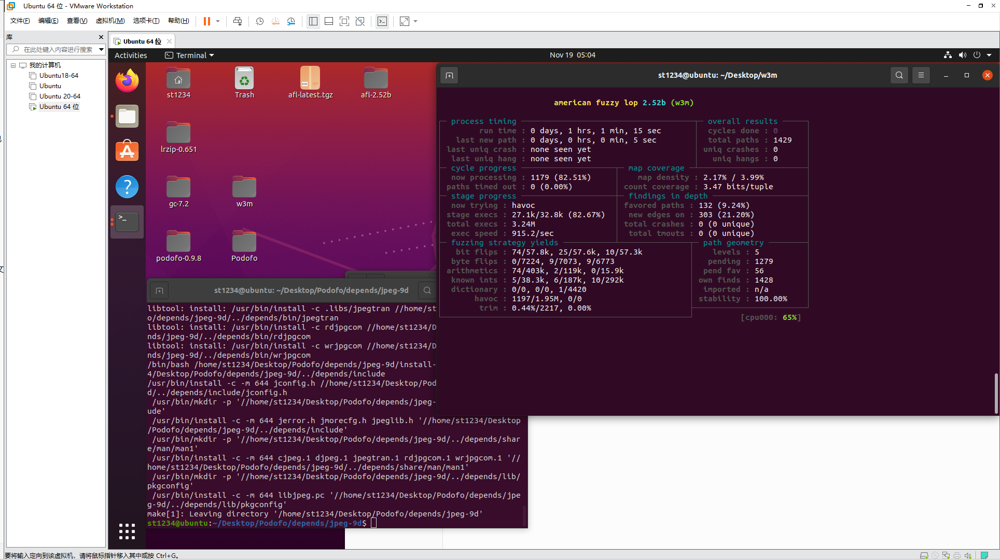

## 3.插桩

1.重新解压，放入mull.yml，插桩

```
export CC=clang-12
export CFLAGS="-fexperimental-new-pass-manager -fpass-plugin=/usr/lib/mull-ir-frontend-12 -g -grecord-command-line"
./configure
make
```

2.效果

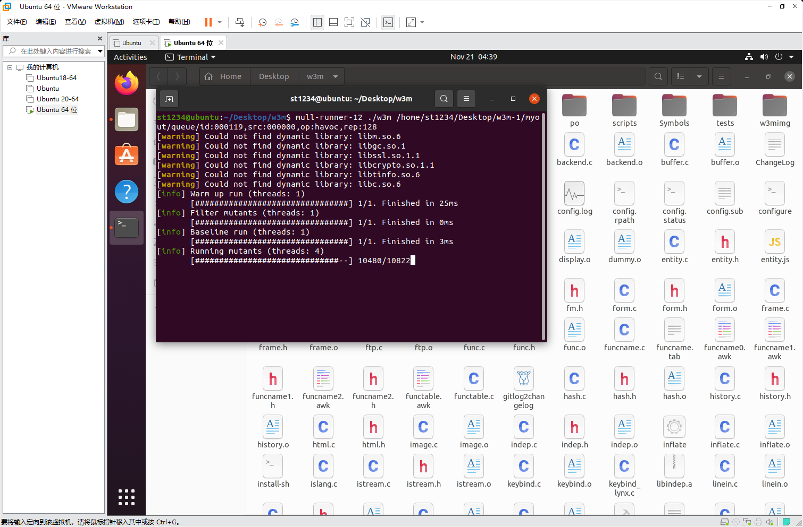

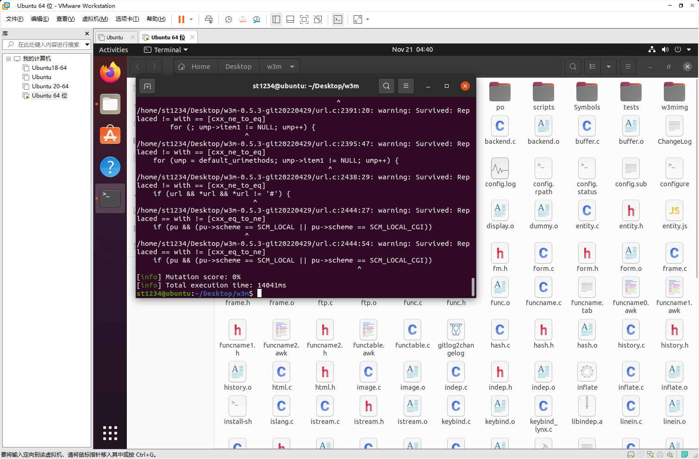

# 三、AFL图

见同目录下压缩包。


