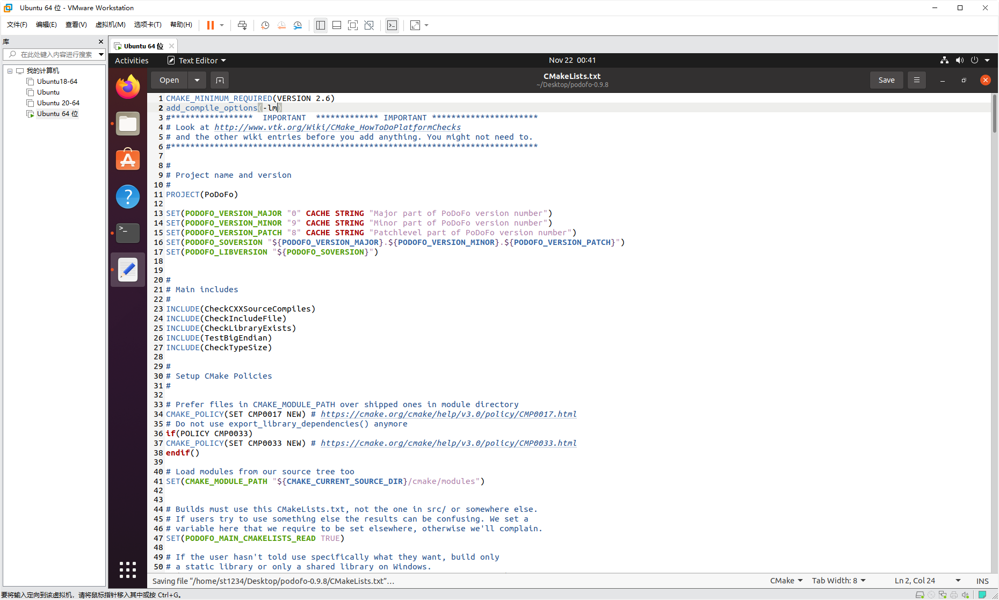

# 三、PoDoFo

## 1.使用PoDoFo自带的文档进行安装（坑）


在使用自带文档进行安装的时候，出现了

找不到mem.h和BaseTsd.h的问题，经过检查发现是缺少一系列的库：


这之后，安装libcrypto和openssl成功，但是其它的库安装后识别不到：


既然库安装不成功，就采用挂依赖的方式，但仍然不成功：


最后采用强制确定安装位置的方法成功进行cmake：


可是在make的时候又显示缺少文件，在网络上没有查到原理。

## 2.柳暗花明又一村（AFL FUZZ）

在复现错误的时候，发现这次make能够正常进行了……

经过分析，原因是因为某个缺少的库在安装之后必须重启才能正常发挥作用。


接下来尝试AFL。出现了core dump，使用 sudo echo core '>/proc/sys/kernel/core_pattern'即可


接下来出现了测试用例识别不到的问题，将测试用例进行一定填充即可。


随后出现了没有权限的问题。跑一下sudo chmod 777 文件即可。


之后出现了check_binary的问题。经过研究，这是因为没有用afl-gcc挂上。


为了解决这种问题，必须在cmake过程中做文章。

我先尝试在makefile中直接令 CC=afl-gcc，但是不可用，因为程序中还包含C++库，无法识别。


接下来开始在cmake中就解决这个问题。


根据启发，尝试输入以下代码：

```
cmake CMakeLists.txt -DCMAKE_C_COMPILER=afl-gcc -DCMAKE_CXX_COMPILER=afl-g++
cmake -G "Unix Makefiles" -DCMAKE_C_COMPILER=afl-gcc -DCMAKE_CXX_COMPILER=afl-g++ -DCMAKE_INSTALL_PREFIX="/home/st1234/Desktop/podofo_attempt3/podofo" ../podofo-src

```

从理论来说，这是成功的。但是编译器找不到g++。

这是因为，g++的条件是依赖的，无法直接运行。


后来将afl-g++换成了afl-clang，解决了该问题，但是在make过程中又报错！


搜索获得结果是由于在cmake过程中没有加入链接选项-lm，于是我们更改了cmakelists.txt，重新进行试验：

```
add_compile_options(-lm)
```



结果仍然一样，这是因为clang不支持，把之前的afl-clang改成afl-clang++就解决问题了。

此时终于make成功


成功之后，采用输入参数的方法，由于podofo的可执行文件过多，我们随机使用了一个

```
podofo-0.9.8/tools/podofocountpages/podofocountpages
```

进行试验，输入采用podofo-0.9.8/test/pdfs中的pdf文件。

afl试验结果如下：


## 3.插桩 又是一场腥风血雨

重新解压 放入mull.yml，插桩

```
export CC=clang-12
export CFLAGS="-fexperimental-new-pass-manager -fpass-plugin=/usr/lib/mull-ir-frontend-12 -g -grecord-command-line"
cmake CMakeLists.txt
make
```

效果：

```
mull-runner-12 ./tools/podofocountpages/podofocountpages /home/st1234/Desktop/podofo-0.9.8-1/myout/queue/id:000002,src:000000,op:flip1,pos:5,+cov
```

找不到dynamic library：


## 4.afl画图

见同目录下img


